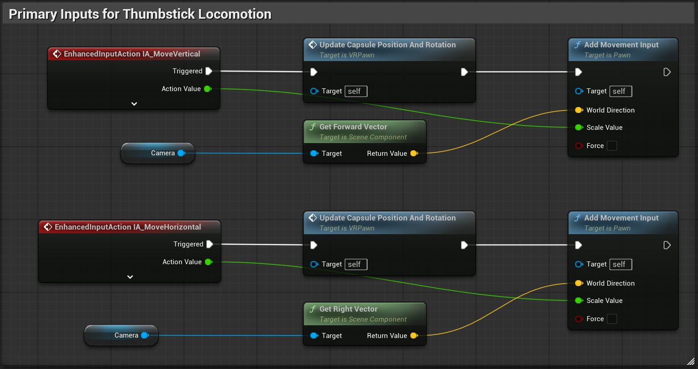

We will use the custom actions we created in the previous step to move our character. This will be done by using the `Input Actions` we created [at the beginning of the *Movement and Input* subsection](create-the-controls.md).

For this, we add two new EnhancedInputAction events to the VR Pawn's Event Graph. These events will be triggered when the player presses the left thumbstick up or down. How do we know this happened? Because we created the input actions. The events are called `IA_MoveVertical` and `IA_MoveHorizontal`.

We will use the `IA_MoveVertical` event to move our character forward and backward, and the `IA_MoveHorizontal` event to move our character left and right.

