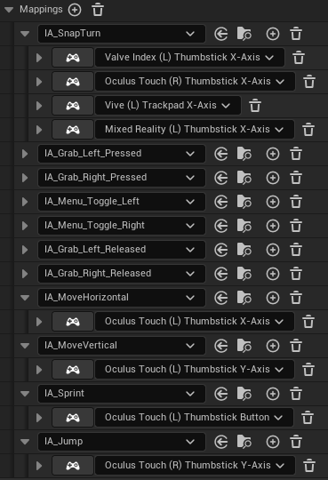

First, we need to create the controls for our movement system. This will include creating input actions for movement, sprinting, and jumping.

For this, we will use ***Unreal Engine 5's** Enhanced Input System*. This system allows us to create input actions and map them to different input devices, such as gamepads, keyboards, and VR controllers via the Input Mapping Context (IMC).

## Input Actions

In this section, we will create the input actions that will be used to control the player character's movement, sprinting and jumping.

1. Create four new input actions in the `Content/VRTemplate/Input/Actions` folder:
  
    - **IA_MoveHorizontal** (Axis1D (float))
    - **IA_MoveVertical** (Axis1D (float))
    - **IA_Jump** (Axis1D (float)) (because we want to use *left thumbstick down* to jump)
    - **IA_Sprint** (Digital (bool))

2. Rename **IA_Turn** to **IA_SnapTurn** (because this is what it actually does)
3. Duplicate **B_InputModifier_XAxisPositiveOnly** and rename it to **B_InputModifier_XAxisNegativeOnly**, then double click and change `Min` to `-1.0` and `Max` to `0.0`. This will be used to jump the left thumbstick is moved down.

### Input Mapping Context (IMC)

Modify **IMC_Default** to map the new input actions to the headset's controllers. This will allow us to use the new input actions we created in the previous step.

They should look like this:

