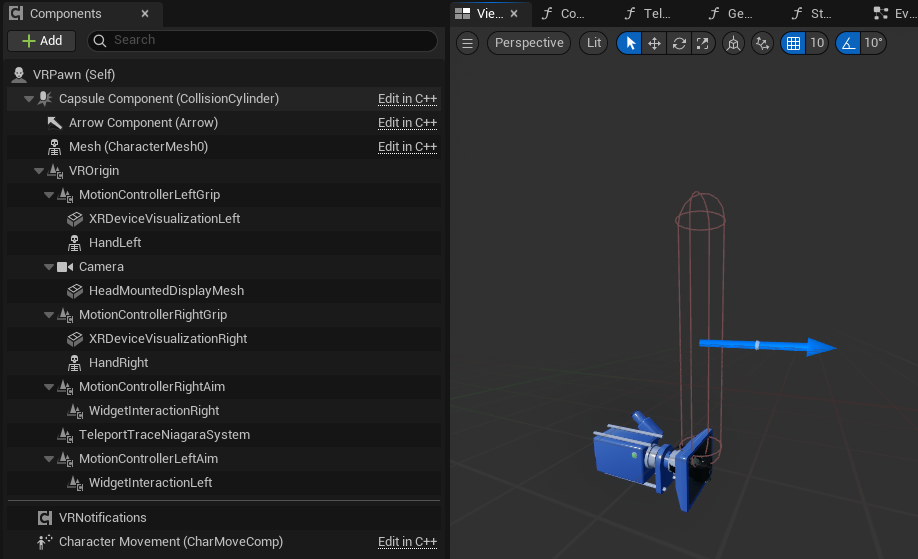
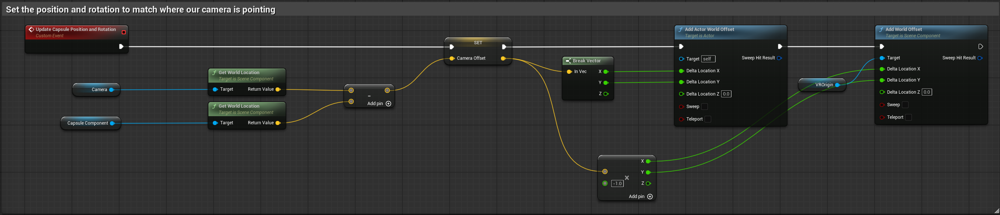
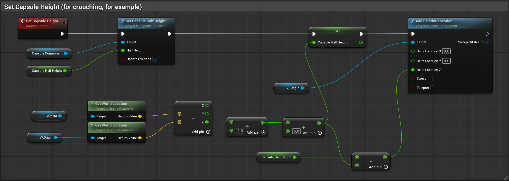

In this section, we will be modifying the VR Pawn to use the new input actions we created in the previous step.

At the end of this mini-tutorial, we want to get something like this:

*Let's start!*

### Character Class and VR Origin

A very important step is to change the VRPawn to a **Character class**. This is because a VR Pawn is a **Pawn** class and does not have the same movement capabilities as a Character class. It also does not have a capsule component - it is essentially a camera with hands.

Next, we want to set our VR origin to the right height on the capsule. Click the VROrigin in the Components tab (left side of the editor) and set the Location transform to `0.0, 0.0, -90.0`. This will set the VR origin at the bottom of the capsule.

We also want to make the capsule slimmer, by changing the `Capsule Radius` to `15.0`. This will make the capsule more like a human character.

So up until now, we have:

- set our capsule to the correct width
- set our vr origin to the right height on the capsule

### Set the position and rotation of the capsule to match where our camera is pointing

This will be done in the VR Pawn's blueprint (check `Update Capsule Position and Rotation` custom event).

The idea here is that we want to be able to move where we look. For this, we need to subtract our camera location from the capsule location. This will give us a vector that we can use to set the capsule's location.

> TIP: You can select two nodes and press Q on your keyboard to align them.

### Set the capsule height to match the camera height

Check the `Set Capsule Height` custom event in the VR Pawn's blueprint. We do this to match crouching and other "movements" that we do in the real world. This will make the character feel more realistic and immersive.

### Fix a common bug

Now, after doing all of this, you might notice that if we step on grabbable objects, or touch them with our "body", we will be pushed away. This is because we need to create a **custom collision** which will allow us to ignore those interactable objects, therefore we will not be pushed away.

This is done from the project settings. Also, make sure to actually set the new collision preset we create to both our VR Pawn and the problematic objects. *DO NOT FORGET THE (PISTOL) PROJECTILES!*

## Conclusion

Great! ✨ We now have a fully functional VR Character that can move around the world and interact with objects. In the next section, we will be adding some more advanced features, such as sprinting and jumping.
