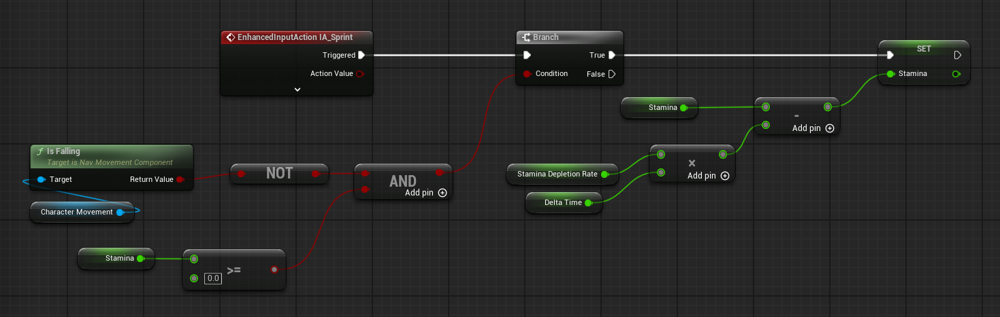

Alright, let's add sprinting to our character. In order for our character to be able to sprint, we must check for two things:

- the character is not falling
- the stamina is not empty

If both of these conditions are met, we must run our stamina depletion code. Else, we will set the character's speed to the normal speed and regenerate stamina. Let's start with the depletion code.

## Stamina depletion

We will create a new variable called `Stamina` and set it to 100.0. This will be our maximum stamina.

We will also create a new variable called `StaminaDepletionRate` and set it to 35.0. This will be the rate at which we deplete our stamina. Additionally, we need to create a [DeltaTime](../reference/delta-time.md) variable, which we will set using the Event Tick event (add it if it is not already added).

Then, we will multiply the `StaminaDepletionRate` by the `DeltaTime` variable and subtract it from our stamina. This will give us a smooth depletion of stamina over time. Below is a screenshot of the blueprint we created for this:

