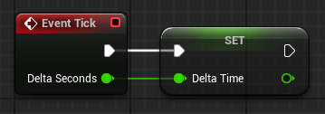

In Unreal Engine (and game development in general), **Delta Time** (often referred to as `DeltaSeconds`) represents **the amount of time (in seconds) that has passed since the last frame**. It's a crucial value for making sure that game behavior is frame rate independent.

## 🧠 Why Delta Time Matters

If your game runs at 30 FPS, each frame takes about 0.033 seconds. At 60 FPS, it's about 0.016 seconds. Without delta time, your movement or animations would behave differently depending on how fast the game is running.

## 💡 Example Usage: Movement

In a typical game loop, you might have something like this:

```cpp
void Update(float DeltaTime)
{
    // Move the player forward at a speed of 100 units per second
    Player.Position += Player.Forward * 100.0f * DeltaTime;
}
```

DeltaTime scales the movement to make it consistent across all frame rates.

In Blueprints, however, the **Event Tick** node gives you `Delta Seconds` as an output pin.


