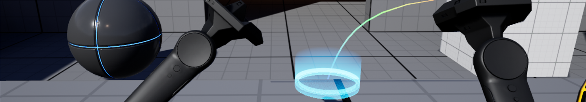

Unreal Engine's VR Template is a great starting point for creating virtual reality experiences. In this section, we will explore the basic functionality of the VR Template and plan the modifications we want to implement.

## The VR Template

The VR Template is a pre-configured project in Unreal Engine that provides a starting point for creating VR experiences. It includes basic functionality such as teleportation, grabbing objects, and interacting with the environment. More information about the VR Template can be found in the [Unreal Engine documentation](https://dev.epicgames.com/documentation/en-us/unreal-engine/vr-template-in-unreal-engine).

## Test the Template

Steam VR is a virtual reality platform that supports a wide range of VR headsets. The VR Template in Unreal Engine 5.5 is designed to work with Steam VR, allowing you to test immersive VR experiences directly in the editor.

Since we are using the Oculus Quest 2, we will use the Oculus Link to connect the headset to the PC. Steam VR will detect the headset and allow you to test the UE project.

### Navigating around

Using the teleportation feature, you can move around the virtual environment by pointing to a location using the right controller's thumbstick.

With the left controller's thumbstick, you can rotate the camera view. This allows you to look around the environment without moving your head/feet.

This is a common way of movement in VR, as it allows for simple controls and reduces the risk of motion sickness. However, I will rewrite, or rather implement, a new movement system that allows for more natural movement by thumbstick. This will be done in [the movement system section](./movement.md).

### Grabbing objects

Naturally, we can grab objects in the VR Template. This is done by pressing the trigger buttons. The object will be attached to the controller, and you can move it around in the virtual environment.

There are two types of grabbing: **free** and **snap**. These grab types are defined in the GrabType Enum asset as follows:

- **Free**: The Actor stays in the position and orientation relative to where the Motion Controller grabbed it. See the small cubes as an example.

- **Snap**: The Actor has a specific position and orientation relative to the Motion Controller. See the pistols as an example.

These two are great as well. One improvement, however, is to add a **procedural hand grip animation** to the free grab. This will make the grabbing feel more natural and immersive. The hand will automatically adjust to the shape of the object being grabbed, making it feel like you are actually holding it.
